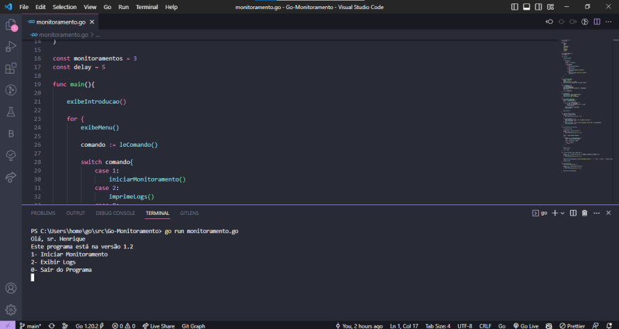

# Go-Monitoramento

<b>Versão do sistema:</b> 1.2

## #Sobre o projeto

Projeto de monitoramento de sites, parte do curso "Go: a linguagem do Google" da @alura. Esse foi um projeto criado para o estudo da linguagem Go, sendo assim, o foco foi a utilização das estruturas básicas de programação e dos principais pacotes Go.

## #Para executar o projeto

Compila e executa o programa "monitoramento", dentro do arquivo <i>site.txt</i> (localizado na mesma pasta do programa) devem estar listados todos os sites a serem monitorados.

    go run monitoramento.go
    
## #Preview

Uma pré-visualização do projeto:

### Tela inicial

    

